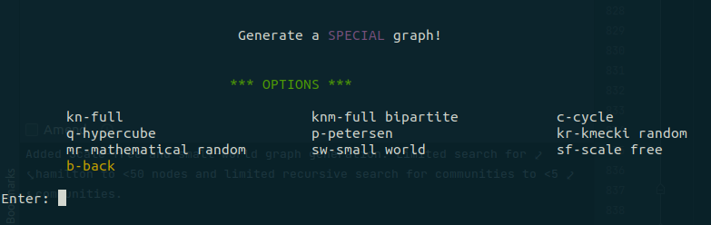

# Network Analysis Program

Made for a seminar work at UNI.

***

#### How to run:

- run ```python3 main.py``` or equivalent in terminal

#### How to use?

The program runs in a terminal and has listed available options to follow.

#### Loading in a graph

- You can load in a new graph from a text file
- Or load a previously loaded graph


Each line of the text file has to have either 1 or 2 node names seperated by a space:

```
a b
1 2
1 b
d
...
```

Each new line represents either a connection between 2 nodes or a single node.

#### Generating a mathematical graph

There are a number of options for generating simple graph for any number of nodes **n**:

- **Kn** complete graphs
- **Kn,m** bipartite complete graph
- **Cn** cycles
- **Qn** hypercubes

#### Generating a random graph

I have added a couple of procedurally generated graphs:

- **'Kmecki' random** select a number of nodes and edges and blindly throw them in
- **'Mathematical' random** create a set amount of nodes and on each pair of nodes decide if they have a connection
  based on p
- **Small world** creates a cycle of n nodes with added connections to 2 steps away, then based on probability p,
  reconnect an edge to another node.
- **Scale free** Barabasi Albert scale free graph building, start with a clique (Kn) of m0 nodes, then for each new node
  connect it to m other nodes, with preference to higher degree nodes. End when n nodes are reached.



### Analysis

So, lets breakdown what this program can find out.

#### Graph Level


On the bigger scale the program checks for:

- **Connectivity:** If the graph is completely connected.
- **Partitions:** If it is not, how many connected parts there are.
- **Communities:** Recursively erases edges and saves a subgraph if it has more partitions than before. Ends when all
  edges have the same betweeness.

  

- **Euler/Hamilton path/circuit:** If they are possible it finds them and saves them for display, if not tells you
  why they are not.

  
  


- **Bipartite:** Checks if the graph is bipartite, if yes colors the nodes, if not finds an odd cycle and displays it.


- **Min / Max / Avg:** For all node and edge specific data (like, density, diameter and so on).
- **Subgraphs:** Made for communities can be loaded from the main graph to see the same information as for main graph
- **Adjacency Matrix:** Ones for connection, Zeros for not.

  

#### Node / Edge Level


On the node and edge level the program analyses and saves:

- **Degree:** Number of edges connecting the node.
- **Clustering Coefficient:** At a social distance of 1.
- **Betweeness:** How many shortest paths go through a node or edge compared to all shortest paths.
- **Closeness:** Average path length from this node to all other nodes.
- **Social Distances:** All nodes at a specific away from this node.
- **Bridges:** All paths where this node or edge where it acts as a bridge.
- ...


